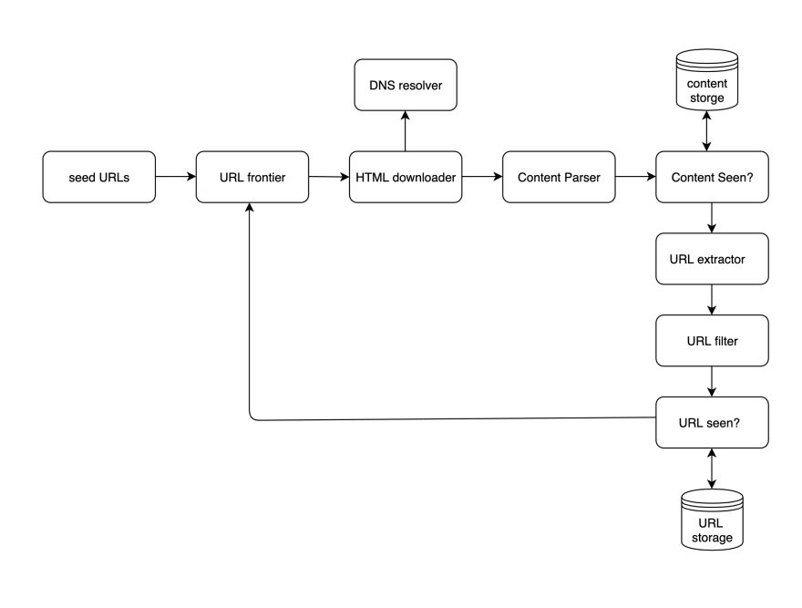
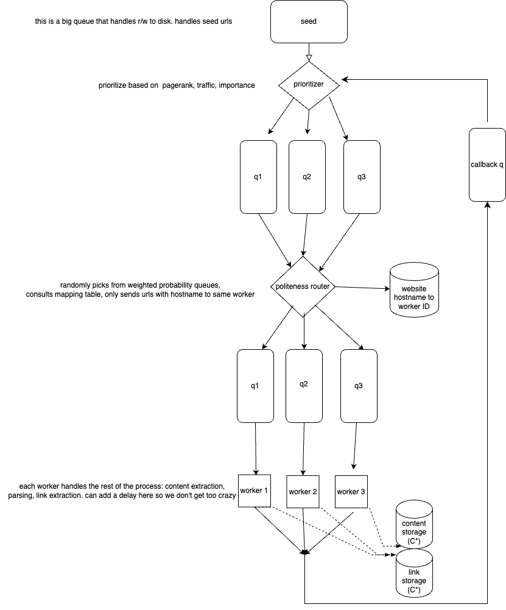

# mySpider
Web Crawler!

## Design
Below shows a high level design:

Components needed:

1. URL frontier: basically main (big) queue that has stuff partially on disk. This should be a DB
    1. URL frontier is one node that talks to disk and queue, then sends off to other distributed queues
2. Prioritizer
    1. consumes from queue
    2. computes priority for each message, pushes to queues q1…qn weighted by p
3. Politeness router
    1. pulls from queues randomly based on priority. consults mapping table for domains.
    2. pushes messages to workers - workers only process messages from the same domain, so as to not DDOS any client.

From here down, workers handle the rest!

1. HTML downloader
	1. Pulls the actual web page. Maybe renders embedded JS.
    2. Optional: DNS cache
2. content parser
    1. Validate content
    2. Check if we've seen this content before via Blob Storage
    3. Module plugin
    	1. This is where the actual "job" of the web crawler is done. Sometimes you archive pages, sometimes you rank them... the point is the crawler is extensible.
3. Link extractor
	1. Detect and pull links from the HTML
4. link filter
    1. Validate this is a well-formed link
    2. Check if we've seen this link before via URL storage.
    3. If both checks pass, publish the URL to the frontier!

### URL Frontier design
Below shows the design of the url frontier - how we begin, prioritize, and distribute our workload to workers.

Our prioritizers consume from our main URL queue and decide which pages are most worth visiting. This can be done on many criteria, here I just use PageRank from OpenPageRank. The pages more worth visiting are published to higher priority queues, with a degree of randomness to avoid hotspots.

Our Politeness router pulls from queues based on their weights - higher priority queues are more likely to be chosen.
Upon choosing a queue and receiving a message, the url is stripped for the domain and if any worker is already handling pages in that domain, the url always goes to that worker. This is to reduce the volume of requests per minute to any specific host - i.e. "politeness". We maintain a Redis cache between politeness router instances to check this mapping.

Each worker has its own dedicated queue. Once it receives a message, it goes to work actually downloading and parsing the content!
